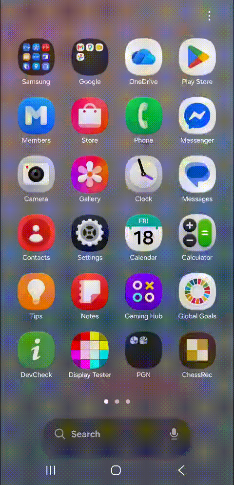

# ChessRec (Android)

  

Kotlin + Jetpack Compose + CameraX, with real on-device recognition via
[ChessQueries](https://github.com/JSeytre/chessqueries)
(`chessquerieslite-vits-644-int8.onnx`, run through ONNX Runtime Mobile).

**License:** the model weights are PolyForm Noncommercial 1.0.0 —
personal/noncommercial use only. Do not ship this build with ads, IAP, or
any paid distribution.

**Before building:** download the model and place it at
`app/src/main/assets/models/chessquerieslite-vits-644-int8.onnx`
(see the placeholder file already in that folder for the exact link).

## How recognition works (`ChessQueriesRecognizer.kt`)
Confirmed directly from the model's own training source, not guessed:
- **Preprocess:** plain (non-aspect-preserving) resize to 644×644, scale to
  [0,1], ImageNet-normalize (`mean=[0.485,0.456,0.406]`,
  `std=[0.229,0.224,0.225]`), CHW layout.
- **Output:** `[1, 64, 13]` logits. Squares are in standard FEN order
  (a8..h8, a7..h7, ..., a1..h1) — matches `parseBoard()` in `Fen.kt` as-is.
- **Classes:** index into `".PNBRQKpnbrqk"` (0 = empty).
- Mean softmax confidence below 0.5 → `null` → `ErrorScreen`, same UX as the
  earlier fake-data version.
- The model predicts piece placement only; side-to-move/castling/en-passant
  default to `w KQkq - 0 1`, same simplification as the web MVP — Lichess
  Editor lets the user fix the rest.

## Screens
- **Home** — `Scan position` (camera) / `Upload a photo` (gallery fallback)
- **Camera** — CameraX preview, 8×8 guide grid with corner brackets, shutter
- **Recognizing** — captured photo dimmed under an animated scanning sweep
- **Result** — board redrawn from the FEN in Unicode pieces, FEN + copy button,
  **Open in Lichess Editor** (`ACTION_VIEW` intent to
  `https://lichess.org/editor/<piece_placement>`)
- **Error** — simulated misread with a Try again button

## Build it
This project was written and reviewed here, but **not compiled** — this
environment's network is limited to GitHub/npm/PyPI/crates.io and doesn't
reach Google's Maven repo (`dl.google.com`), which the Android Gradle Plugin
and androidx/CameraX artifacts are fetched from. To get an installable APK:

1. Open the `ChessVision/` folder in Android Studio (Koala or newer).
2. Let Gradle sync — it will download the AGP/Compose/CameraX dependencies.
3. Run on a device/emulator, or **Build ▸ Generate Signed/Unsigned APK**.

## Notes / follow-ups
- Uses the system serif/monospace fonts as stand-ins for Lora / IBM Plex Mono.
  Drop matching `.ttf` files into `res/font/` and update
  `ui/theme/Theme.kt` (`DisplayFont`, `MonoFont`) to match the web version's
  typography exactly.
- `minSdk 24` / `compileSdk 34`. Camera permission is requested at runtime;
  denial falls back to the gallery picker automatically.
- The model asset adds ~36MB to the APK. Fine for personal use; if this ever
  grows beyond a personal project, look at Play Feature Delivery (on-demand
  asset packs) instead of bundling it in the base APK — and re-check the
  license, since PolyForm Noncommercial forbids that kind of distribution
  anyway.
- Inference runs on `Dispatchers.Default` via CPU execution provider, which
  is the safest choice for a quantized (int8) model. NNAPI/XNNPACK can be
  tried later for speed, but test carefully — quantized-op support on NNAPI
  varies a lot across devices.
